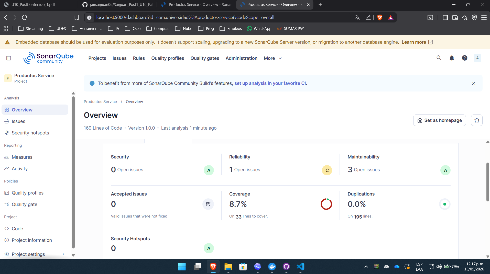
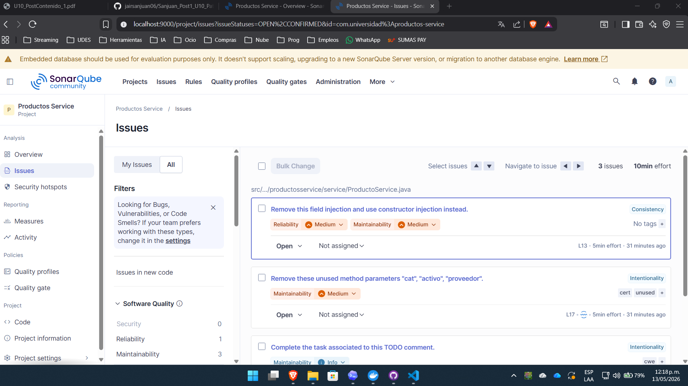
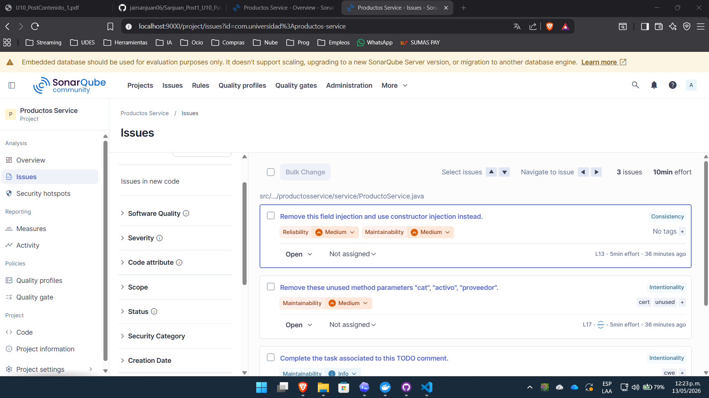

# Productos Service - Post-Contenido 2

[](../../actions/workflows/ci.yml)

Proyecto practico de la Unidad 10 del curso Patrones de Diseno de Software. Este segundo laboratorio configura un Quality Gate personalizado, corrige hallazgos del primer analisis de SonarQube, mejora la cobertura con JaCoCo e integra una verificacion automatica con GitHub Actions.

## Quality Gate personalizado

En SonarQube se creo el Quality Gate **Estandar Universidad** y se asigno al proyecto `Productos Service`.

Condiciones configuradas:

| Metrica | Condicion |
|---------|-----------|
| Bugs | Bloquear si es mayor que 0 |
| Coverage | Bloquear si es menor que 60% |
| Code Smells | Bloquear si es mayor que 5 |
| Duplicated Lines (%) | Bloquear si es mayor que 5% |

## Ejecucion local

Levantar SonarQube con Docker:

```bash
docker start sonarqube
```

Si el contenedor no existe, crearlo con:

```bash
docker run -d --name sonarqube -p 9000:9000 -e SONAR_ES_BOOTSTRAP_CHECKS_DISABLE=true sonarqube:community
```

Compilar, ejecutar pruebas y generar cobertura:

```bash
mvn clean verify
```

Ejecutar el segundo analisis de SonarQube:

```bash
mvn clean verify sonar:sonar "-Dsonar.token=TU_TOKEN" "-Dsonar.host.url=http://localhost:9000"
```

## Comparacion antes y despues

| Metrica | Analisis inicial | Segundo analisis |
|---------|------------------|------------------|
| Bugs | Pendiente de dashboard inicial | Pendiente de dashboard final |
| Vulnerabilidades | Pendiente de dashboard inicial | Pendiente de dashboard final |
| Code Smells | Pendiente de dashboard inicial | Pendiente de dashboard final |
| Cobertura de lineas | 16.7% segun JaCoCo local | 89.7% segun JaCoCo local |
| Quality Gate | Fallido o pendiente | Pendiente de dashboard final |

## Correcciones aplicadas

### Bug corregido: retorno nulo en buscar()

- Archivo: `src/main/java/com/universidad/productosservice/service/ProductoService.java`
- Antes: `repo.findById(id).orElse(null)`
- Despues: `orElseThrow(...)` con `NoSuchElementException`
- Impacto: evita que las capas consumidoras reciban `null` y sufran un `NullPointerException` posterior.

### Code Smell 1: inyeccion por campo

- Antes: `@Autowired` sobre el atributo `repo`.
- Despues: inyeccion por constructor con `private final ProductoRepository productoRepository`.
- Impacto: dependencias mas explicitas y servicio mas facil de probar.

### Code Smell 2: validacion de cadena vacia

- Antes: `n == null || n.equals("")`.
- Despues: `nombre == null || nombre.isBlank()`.
- Impacto: tambien rechaza cadenas con solo espacios.

### Code Smell 3: complejidad del metodo principal

- Antes: `procesarProducto(...)` mezclaba orquestacion, validaciones y persistencia.
- Despues: se extrajo `validarDatos(...)`.
- Impacto: el metodo principal queda mas simple y enfocado.

## Pruebas agregadas

Se agregaron pruebas para:

- Validar que `buscar()` lanza `NoSuchElementException` cuando el producto no existe.
- Cubrir validaciones de nombre, precio y stock.
- Cubrir el flujo exitoso de `procesarProducto(...)`.
- Cubrir varios estados de stock en `Producto.getEstado()`.

Cobertura local despues de las correcciones:

| Tipo | Cobertura |
|------|-----------|
| Instrucciones | 92.3% |
| Ramas | 83.3% |
| Lineas | 89.7% |

## GitHub Actions

El workflow `.github/workflows/ci.yml` ejecuta `mvn clean verify` en cada push o pull request a `main`.

El analisis de SonarQube se documenta como ejecucion local porque el servidor `http://localhost:9000` corre en Docker dentro del equipo del estudiante y no es accesible desde los runners publicos de GitHub Actions.

## Capturas del dashboard

### Analisis inicial





### Segundo analisis

Guardar las capturas finales con estos nombres:


## Interpretacion

El segundo analisis debe mostrar una mejora frente al Post-Contenido 1: se elimina el bug asociado al retorno nulo, se reducen Code Smells de alto impacto y la cobertura local aumenta por la incorporacion de pruebas automatizadas. Si el Quality Gate no pasa, el dashboard permite identificar con precision que condicion sigue pendiente.
